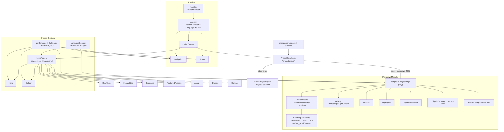

```mermaid
flowchart TB
  subgraph Runtime
    main["main.tsx<br>RouterProvider"] --> app["App.tsx<br>HelmetProvider + LanguageProvider"]
    app --> nav[Navigation]
    app --> outlet["Outlet (routes)"]
    app --> footer[Footer]
  end

  %% Routing
  outlet --> home["HomePage '/'<br>lazy sections + hash scroll"]
  outlet --> detail["ProjectDetailPage '/projects/:slug'"]

  %% Home sections
  home --> hero[Hero]
  home --> metatags[MetaTags]
  home --> impactstrip[ImpactStrip]
  home --> sponsors[Sponsors]
  home --> featured[FeaturedProjects]
  home --> about[About]
  home --> gallery[Gallery]
  home --> donate[Donate]
  home --> contact[Contact]

  %% Project detail branching
  detail --> |"slug = mangrove-2025"| mangrovePage["Mangrove ProjectPage (lazy)"]
  detail --> |"other slugs"| genericPage["GenericProjectLayout / ProjectNotFound"]

  subgraph MangroveModule [Mangrove Module]
    mangrovePage --> overallImpact["OverallImpact<br>Cloudinary seedlings backdrop"]
    mangrovePage --> mangroveGallery["Gallery (PhotoSwipe/LightGallery)"]
    mangrovePage --> phases[Phases]
    mangrovePage --> highlights[Highlights]
    mangrovePage --> sponsorsSection[SponsorsSection]
    mangrovePage --> campaign["Digital Campaign / Impact cards"]
    overallImpact --> impactCards["Seedlings / Reach / Interactions / Carbon cards<br>useStaggeredCounters"]
    mangrovePage --> impactData["mangroveImpact2025 data"]
  end

  %% Shared services / integrations
  subgraph SharedServices [Shared Services]
    language["LanguageContext<br>translations + toggle"] --> nav
    language --> home
    language --> mangrovePage
    cloudinary["getCldImage + CldImage<br>cldAssets registry"] --> nav
    cloudinary --> footer
    cloudinary --> hero
    cloudinary --> gallery
    cloudinary --> mangrovePage
  end

  %% Data & services
  projectsRegistry["modules/projects.ts + types.ts"] --> detail
```
